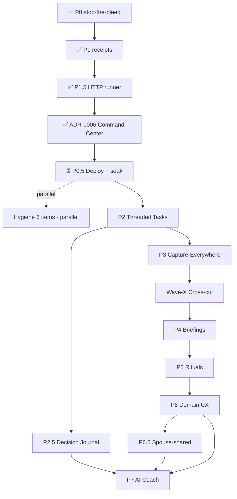

# Life OS v1.0 — Master Roadmap

> **Status:** Synthesis of 7 parallel deep-dive specs landed 2026-05-12. All linked specs live in `docs/superpowers/phases/` (operational) and `docs/superpowers/specs/` (design-deep). This doc is the **navigable index + sequencing + decision register** — depth lives in the spec files.

**Date:** 2026-05-12 · *Superseded by [ADR-0007 Master Plan v2](../adr/0007-master-plan-v2.md). Live numbers at [docs/CURRENT-STATE.md](../CURRENT-STATE.md).*
**Branch:** `polish/prod-ready` (numbers stale at write-time; see CURRENT-STATE.md)
**Current state at write-time (2026-05-12):** P0 + P1 + P1.5 + ADR-0006 code-complete; awaiting LXC deploy. By 2026-05-16, all four had deployed and soak Day 6/7 was underway.

---

## TL;DR — what changed vs. the CLAUDE.md roadmap

The original roadmap had **7 phases**. After the deep-dive pass, the recommendation is **9 phases + 1 cross-cut wave**, with one new high-leverage insertion (**P2.5 Decision Journal**) and one explicit cross-cutting checkpoint (**Wave-X**) between P3 and P4:

| Original | Revised | Why |
|---|---|---|
| P0 Stop the bleed ✅ | unchanged | shipped `2b518b1` |
| P1 + P1.5 + ADR-0006 ✅ code, ⏳ deploy | **P0.5** (deploy + soak) — operational, not design | Concrete blocking gate; needs its own playbook |
| P2 Threaded tasks | unchanged | The largest design lift; spec must promote to ADR-0007 |
| — | **NEW: P2.5 Decision Journal** | Highest-leverage missing thing (cheapest compounding self-knowledge asset). Hip decision becomes the first worked example. |
| P3 Capture-anywhere | unchanged but **voice promoted to primary surface** | Cuts capture friction 3-5× |
| — | **NEW: Wave-X Cross-Cut** | Security + eval + observability + docs before AI-heavy phases |
| P4 Decision-ready briefings | unchanged | Now eval-gated |
| P5 Review rituals | unchanged | |
| P6 Domain-aware UX | expanded with 4 named deliverables (sermon-prep, CRM-lite, health-anomaly, family-timeline) | |
| — | **NEW: P6.5 Spouse-shared** | Christy gets a slice (family/home dashboards, family rocks) |
| P7 AI Coach / Insight loop | unchanged + annual podcast deliverable | Must remain last; corrosive failure mode |

---

## The "Definition of Amazing" — release rubric for v1.0

Adopted from cross-cutting agent's analysis. The system has shipped Life OS v1.0 when **all 7** are true:

1. **Daily Command Center is the only file Aaron opens to start his day** — every other entry point is a deeplink from it.
2. **Capture-to-action latency p95 < 24 hours** — anything captured before bed shows up in tomorrow's briefing.
3. **Every AI output is eval-gated, never raw model output** — confidence labels everywhere, factuality enforced.
4. **Sensitive data never reaches a free-tier model** — classifier-enforced, not hope-enforced. Faith, family-named, kid-named, prayer-journal, health-biomarker content stays on-device or on paid tier.
5. **System survives any single-component failure 7 days without operator intervention** — chaos-tested.
6. **Decision Journal has ≥10 reviewed decisions with 90-day outcomes documented** — calibration loop running.
7. **≥2 life domains have a feature no off-the-shelf tool offers** — sermon-prep, decision-journal-w/-outcomes, spouse-shared rocks, biomarker-anomaly signal, CRM-lite. At least two live + weekly-touched.

---

## Phase map (revised)

```
✅ P0      Stop-the-bleed                                         [shipped 2b518b1]
✅ P1      State machine + receipts + gated reset                 [code f3f8325→947e507]
✅ P1.5    HTTP-runner sidecar (n8n 2.x compat)                   [code a1bd438]
✅ ADR-06  Daily Command Center                                   [code 097892a]
⏳ P0.5    Deploy + soak (≥7 days clean)                          [operational; gates everything below]
   │
   ├──→ Hygiene Carry-Forwards (6 items, fully parallel)         [runs concurrent with soak]
   │
🔒 P2      Threaded tasks (stable IDs, backing files, audit)     [soak must close first]
🔒 P2.5    Decision Journal                                       [NEW; ships alongside P2]
🔒 P3      Capture-Everywhere (voice-first)                       [P2 IDs required for thread continuity]
🔒 Wave-X  Cross-cut: security + eval + observability + docs     [NEW; before AI-heavy P4-P7]
🔒 P4      Decision-Ready Briefings                               [eval-gated]
🔒 P5      Review Rituals (daily/weekly/monthly/quarterly/annual)
🔒 P6      Domain-Aware UX (8 domains, 4 named deliverables)
🔒 P6.5    Spouse-Shared Mode (Christy's slice)                  [NEW]
🔒 P7      AI Coach + Insight Loop                                [must be last; corrosive failure mode]
```

**Soak gate (hard rule, do not relax):** P1+P1.5+ADR-0006 must run clean in prod for ≥7 days before P2 starts. **While that gate is open: no new capture surfaces, no AI insight scripts, no domain UX scope.** Only hygiene items in the carry-forward list are safe to ship.

---

## Execution timeline — parallel lanes

Estimated wall-clock from today (2026-05-12). XS=hours, S=1-2 days, M=3-7 days, L=1-3 weeks, XL=3-6 weeks.

```
Week 1  [P0.5 deploy ▓▓▓▓▓▓ S      ] [Hygiene 1 GCAL ▓ S       ] [Hygiene 6 NLM ▓ XS]
Week 1  [Hygiene 5 TG-rotate ▓ XS  ] [Hygiene 2 OpenRouter ▓ S]
Week 2  [               SOAK ▓▓▓▓▓▓▓▓▓▓▓▓▓ 7d                 ] [Hygiene 3 MTL-backfill ▓ M]
Week 3  [SOAK continues / final audit ▓▓▓               ] [Hygiene 4 --no-reset flip ▓ XS]
Week 3  [P2 design freeze + ADR-0007 promotion ▓▓▓ S      ]
Week 4-6  [   P2 IMPLEMENT ▓▓▓▓▓▓▓▓▓▓▓▓▓▓▓▓▓ XL    ] [P2.5 Decision Journal ▓▓▓ M  in parallel]
Week 7-8  [   P3 envelope + voice surface ▓▓▓▓▓▓▓ M       ]
Week 9    [   Wave-X cross-cut ▓▓▓▓▓ M                       ]
Week 10-11 [  P4 briefings ▓▓▓▓▓ M                              ]
Week 12-13 [  P5 rituals ▓▓▓▓▓▓ M                                ]
Week 14-17 [  P6 + P6.5 domain UX + spouse ▓▓▓▓▓▓▓▓▓▓▓ L          ]
Week 18-22 [  P7 AI coach (with 4-week human-in-loop soak) ▓▓▓▓▓▓ L  ]
```

This is **~22 weeks** (5.5 months) to v1.0 from today.

---

## Per-phase index

### ⏳ P0.5 — Deploy + Soak Start (operational)

**Spec:** [`docs/superpowers/phases/2026-05-12-P0-deploy-and-soak-start.md`](phases/2026-05-12-P0-deploy-and-soak-start.md) (46 KB)

**Goal:** Deploy P1+P1.5+ADR-0006 to LXC CT-202, start the ≥7-day soak, exit cleanly to unlock P2.

**Three operational decisions made:**
1. **Pre-flight bucket-versioning gate** (MinIO versioning ON is now an explicit pre-flight, not an assumption).
2. **Binary soak counter with one-shot extension** — gate either passes day 7 or counter resets; a single self-resolving anomaly may extend +24h once.
3. **Tripwires defined in symptom space, not cause space** — operator doesn't need to root-cause to call rollback.

**3 hidden P0 blockers surfaced (not in CLAUDE.md):**
- MinIO bucket versioning explicitly ON.
- First-time `/opt/oho/.env` seeding on LXC (rsync excludes it).
- `pct exec` (memory says Aaron uses this) vs direct SSH mismatch in `deploy_oho_runner.py`.

**Soak-exit gate (locked):** ≥7 consecutive days AND 7+ daily green brain-dump runs AND zero double-extractions AND audit passes every day AND zero human interventions beyond morning check AND zero error-handler emails AND `live-dashboard-updater` ran 24×/day every day AND command center never stale >36h AND no task-runner timeouts AND vault-health-report Sunday email green.

**Open questions:** Q2 `.contains()` patch for emoji-prefix lookup · Q4 setup-n8n.sh reconcile scope · Q5 daily vs weekly receipt audit during soak · Q6 does `make run --dry-run` reset counter.

---

### 🟢 Hygiene Carry-Forwards (6 items, parallel-safe)

**Spec:** [`docs/superpowers/phases/2026-05-12-hygiene-carry-forwards.md`](phases/2026-05-12-hygiene-carry-forwards.md) (28 KB)

| # | Item | Effort | Aaron-hands? | Parallel-safe |
|---|---|---|---|---|
| 1 | GCAL OAuth → Weekend Planner redeploy | S | YES (browser OAuth) | ✅ |
| 2 | OpenRouter key rotation | S | YES (BotFather-equivalent: generate + revoke) | ✅ |
| 3 | MTL `[due::]` / `[completion::]` backfill | M | YES (review report triage) | ✅ |
| 4 | `--no-reset` flag deprecation | XS | NO (gated to soak-complete) | ✅ |
| 5 | agent-orch-lxc Telegram token rotation + scrub | XS | YES (@BotFather only) | ✅ (cross-repo) |
| 6 | NotebookLM stale-ID cleanup | XS | NO | ✅ |

**Key surprise:** Item 3 is more complex than CLAUDE.md implies. **DO NOT auto-tag `[due::]`** — wrong due date is worse than missing. Script restricted to `[completion::]` from real timestamps only; everything else → review report.

**Recommended order:** Fully parallel. If forced to sequence: **6 → (5/2/1 fan out to Aaron) → 3 dry-run → 4 after 2026-05-19**.

**Cross-cutting risks:** Items 1/2/5 all involve a fresh secret in Aaron's hands at once. Standard rotation playbook: old-live → new-live → swap → revoke. Order matters; revoking before swap = downtime.

---

### 🔒 P2 — Threaded Tasks (design-first; ADR-0007 must land first)

**Spec:** [`docs/superpowers/specs/2026-05-12-P2-threaded-tasks-spec.md`](specs/2026-05-12-P2-threaded-tasks-spec.md) (54 KB) → promote to `docs/adr/0007-threaded-tasks.md` before implementation.

**Goal:** Stable task identity across edits, re-extractions, archives, splits, merges, and manual edits.

**ID scheme decided:** `t-<iso-year>w<iso-week-2digit>-<4-hex>` → `t-2026w19-a3f1`. Sorts lexicographically by capture-week (matches weekly-review rhythm); leaves `p-` and `d-` namespaces open for projects/decisions.

**Hardest invariant:** Bidirectional MTL ↔ backing-file sync under concurrent edits (phone via Remotely-Save + cron). Mitigation: identity in `[id::]` and wikilink (never description); deterministic precedence (folder wins area; MTL wins description; YAML wins ties on structured fields); unresolvable diffs go to a "Needs your eyes" queue — system never silently picks.

**Magical moments:**
- Tuesday-capture → Thursday-split keeps single threaded history navigable at weekly review.
- Sunday review opens a Decisions Dashboard where each thread renders as a card (parent + children + sources + completion times).
- Phone retitle mid-cron → identity survives because it's in the wikilink, not the text.

**Two controversial calls needing Aaron:**
1. Default routing: high-confidence regex → `triaged` (ready) vs low-confidence → `captured` (forced human review)?
2. Sunday digest format change from flat list to thread cards (recommend behind feature flag for 2 weeks).

**Dependencies:** P0.5 soak closed; MinIO bucket versioning ON; OHO runner sidecar live (P1.5); Command Center renderer update is a sub-lane within P2.

---

### 🔒 P2.5 — Decision Journal (NEW)

**Spec:** Subsection in [`cross-cutting-and-ambition-spec.md`](specs/2026-05-12-cross-cutting-and-ambition-spec.md) §2.1 — will be promoted to its own spec when P2 design freezes.

**Goal:** Every meaningful decision logged with options-considered + chosen + why + 90-day review.

**Why now:** Zero new infrastructure (reuses P2 task model with `d-` ID prefix). The hip decision is the first worked example. 90-day reviews force the calibration loop. Over a year, Aaron knows his own decision-making quality empirically rather than via vibes. **Cheapest compounding self-knowledge asset in the entire roadmap.**

**Lives at:** `40_Decisions/<area>/d-2026w20-<4hex>.md`

**Magical moment:** The hip decision (flagged in CLAUDE.md for months) becomes Aaron's first journaled decision with a clear 90-day review date. Tracked, audited, reflected on. No more "I keep meaning to decide that."

**Effort:** M (rides on P2 ID model).

---

### 🔒 P3 — Capture-Everywhere (voice-first)

**Spec:** [`docs/superpowers/specs/2026-05-12-P3-P4-capture-and-briefings-spec.md`](specs/2026-05-12-P3-P4-capture-and-briefings-spec.md) (67 KB) — combined with P4.

**Single most important architectural call:** **One canonical capture envelope, one endpoint, all surfaces normalise to it.** `POST /capture` on the OHO runner with bearer auth, asyncio-lock serialised, idempotency-keyed by `(source, source_message_id)`. Every surface is a thin adapter.

**Sequencing:** P3.A (envelope + endpoint) → P3.B (Telegram v2 w/ voice + photo OCR) → P3.C (email-forward + share-sheet + voice-from-phone) → P3.D (wearable + agent-quick-add refactor).

**Voice promoted to primary** (Agent G's re-sequence): Telegram voice + Whisper. Cuts friction 3-5×. Creates the daily intention + reflection moment everything else compounds on.

**Two thorny privacy calls:**
1. **Voice transcripts + raw audio in MinIO.** Whisper-API sees audio; local whisper.cpp is private but flakier. Recommended: local-default with API fallback. Aaron's call on stricter policy.
2. **NotebookLM voice digest opt-in.** Default OFF — prayer queue + decisions + accountability would flow to Google. Worth a deliberate yes/no.

**Capture envelope:**
```json
{
  "envelope_version": 1,
  "source": "telegram|email|voice|share|wearable|agent",
  "source_message_id": "string-stable-key",
  "timestamp": "ISO-8601",
  "raw_text": "...",
  "hints": {"area": "faith", "priority": "A", "tags": ["..."]},
  "attachments": [{"type": "audio", "path": "minio://..."}]
}
```

---

### 🔒 Wave-X — Cross-Cut (NEW; between P3 and P4)

**Spec:** [`docs/superpowers/specs/2026-05-12-cross-cutting-and-ambition-spec.md`](specs/2026-05-12-cross-cutting-and-ambition-spec.md) §1.A-G (40 KB)

Insertion rationale: before AI-heavy phases (P4-P7), invest in the infrastructure that prevents bad AI from corroding trust in the whole system.

**Deliverables (each is a small project):**

| Deliverable | What | Acceptance |
|---|---|---|
| **Data classification system** (1.A + 1.G) | `99_System/data-classes.yaml` (public/private/sensitive). Classifier intercepts AI prompts. | Faith, family-named, prayer, biomarker content NEVER reaches free-tier model. Test enforces. |
| **Eval infrastructure** (1.C) | `evals/` directory, weekly cron, `audit_eval_coverage.py` as release gate. | Every AI-touched workflow has a frozen test set + regression alerts. |
| **Health dashboard** (1.B) | `99_System/health.md` Dataview-rendered from logs. SLOs per workflow. Cost telemetry. | Aaron can answer "is the system healthy?" without reading JSON. |
| **Prompt-injection defenses** (1.A) | Brain-dump extractor doesn't execute instructions inside user content. | Adversarial brain-dump examples in test suite. |
| **`docs/ARCHITECTURE.md`** (1.F) | Auto-generated, current. | Aaron (or Christy, or a future collaborator) can grok the system in 30 min. |
| **Backup + recovery drill** (1.A) | Quarterly restore-from-MinIO + Remotely-Save. | Documented procedure, tested. |

---

### 🔒 P4 — Decision-Ready Briefings

**Spec:** Combined with P3 in [`P3-P4-capture-and-briefings-spec.md`](specs/2026-05-12-P3-P4-capture-and-briefings-spec.md).

**Goal:** Briefing is a **decision instrument**, not a report. Answers "What's the ONE thing today, what 3 unblock decisions, who's holding what?"

**Magical moment:** Shower-thought → Watch dictation → Whisper → envelope → MTL → briefing names it as Today's ONE Thing the next morning, with clickable provenance back to the OGG file.

**Components:**
- Today's ONE Thing (single ranked needle-mover; leverage × urgency × energy-window)
- 3 unblock decisions (explicit `[decision:: needed]` items with options + AI-suggested default)
- Accountability lines ("yesterday I committed to X — status: slipped/done/in-progress")
- Cross-domain conflict surface (business overrun → home commit reduced)
- Energy-window awareness (HRV/sleep → today's recommended difficulty)
- Faith integration (devotional, prayer queue, sermon prep cue)

**Constraints:**
- ≤200-word HTML email; command center carries depth
- Idempotent + fail-safe (regex-first fallback if AI tier fails)
- Provenance on every claim
- Warm + decisive tone, not corporate
- Eval-gated (Wave-X must land first)

---

### 🔒 P5 — Review Rituals

**Spec:** [`docs/superpowers/specs/2026-05-12-P5-P6-rituals-and-domain-ux-spec.md`](specs/2026-05-12-P5-P6-rituals-and-domain-ux-spec.md) (58 KB) — combined with P6.

**Highest-leverage rituals:**
1. **Daily evening close (5 min)** — yesterday-mark-done sweep, today-rate, tomorrow's ONE thing (uses same `pick_top_priority()` logic as Command Center — one source of truth), gratitude, sleep cue.
2. **Weekly review (45 min → 25 min auto-prepped)** — rocks %, domain balance heatmap, AI-drafted compounded/stalled narrative, decisions-deferred parsed from daily notes. Decisions flow into `decisions-log.jsonl` for P4 briefings.

**Missed-ritual UX (hard rules):** No streak reset on first miss. 1-week gap → normal note; 2-3 week gap → combined catch-up note (`2026-W18-W19.md`) with one section per week; 4+ weeks → single "Welcome back. 28-day rollup. This is data, not failure." `longest_streak` is monotonic. Never the word "missed." Never red.

**Monthly / quarterly / annual:** auto-prepped templates so Aaron starts with answers, not blank pages. AI summarizer (Llama 3.3 70B via ai-brain) drafts; Aaron edits.

---

### 🔒 P6 — Domain-Aware UX (8 domains + 4 named deliverables)

**Spec:** Combined with P5 in [`P5-P6-rituals-and-domain-ux-spec.md`](specs/2026-05-12-P5-P6-rituals-and-domain-ux-spec.md).

**Per-domain dashboards** auto-rendered (Dataview): current rocks, open tasks, decisions, recent captures, weekly hours allocated.

**Hidden-complexity domain: Family.** Highest stakes, lowest automation tolerance. Every other domain has clean signals; family is largely *absence-of-signal*. Solved with: opt-out daily hooks (no daily family nag), people-cards driven by vault-local `family.yaml` (gitignored, never AI), cadence-overdue surfacing weekly only, amber not red.

**4 named deliverables (Agent G expansion):**
1. **Sermon-prep assistant** (faith domain) — uses bible-study-theologian + sunday-school-teacher skills; Bible-cross-reference + cite + outline. High-stakes prompt fidelity → strong eval suite required.
2. **CRM-lite** (business domain) — Echelon Seven pipeline + offer-iteration tracking.
3. **Health-anomaly signal** (health domain) — biomarker outliers (Oura/Whoop) trigger "talk to doctor" reminder. Never advice, only signal.
4. **Family-timeline / legacy book** (family domain) — auto-compiled "what happened in our family this year" from the vault. Gift for kids in 30 years.

**Cross-domain magical moment:** `> [!warning]+ Business overshot 5h this week → Home commitments deferred 2.` Drift callout in Command Center. First time Aaron sees the system name his trade-offs back to him.

**AI guardrails:** AI must NOT touch family.* fields (CI test enforces), suggest next quarter's rocks (Aaron alone), produce specific biomarker values in external text (trends only), make decisions, read prayer journal (default off).

---

### 🔒 P6.5 — Spouse-Shared Mode (NEW)

**Spec:** Subsection in [`cross-cutting-and-ambition-spec.md`](specs/2026-05-12-cross-cutting-and-ambition-spec.md) §2.6.

**Goal:** Christy gets a slice of the vault — family + home dashboards + family rocks + ability to capture into family domain.

**Magical moment:** Family rocks become "we" rocks. Christy can add a captures from her phone; they land in the shared family inbox; both see the same weekly family-domain view.

**Risk:** Christy may not want this. **Open question for Aaron** — and the spec is design-only until Aaron's confirmed it.

**Effort:** M.

---

### 🔒 P7 — AI Coach + Insight Loop (must be last)

**Spec:** [`docs/superpowers/specs/2026-05-12-P7-ai-coach-insight-loop-spec.md`](specs/2026-05-12-P7-ai-coach-insight-loop-spec.md) (50 KB)

**Stance on RAG vs direct context:** **Direct file inclusion + grep, no embeddings in v0.** Aaron's corpus fits in a single context window. The hot set (MTL, last 30 days of daily notes, Q2 rocks, last 4 weekly digests) is a fixed-shape structured set — RAG solves a problem that doesn't exist while introducing embedding-version drift + re-rank failure modes. Grep is deterministic, auditable, matches the regex-first principle.

**Top 2 compounding insights:**
1. **Quarterly Horizon loop** — every Sunday: "Echelon Seven MVP rock has 4 open tasks at velocity 0.5/week — projected completion 2026-08-12, 5 weeks past quarter-end." Purely quantitative, grounded in MTL + Q2 rocks. Ship this first.
2. **Deferment Detector + Promise-Keeper** combined — "hip decision: 6 defers in 4 months" + Friday "Monday-you-said, Friday-you-did" ledger. Accountability surface no human friend would maintain.

**Hardest guardrail: "No life decisions."** Mechanical filters work for privacy/medical. "Did this output try to make a decision for Aaron?" requires a model-to-judge-a-model classifier. 50-example hand-labeled set, 95% accuracy required to ship, Aaron has manual flag mechanism that adds violators to the eval dataset.

**Eval rubric most needing Aaron's input: TONE.** Factuality + non-prescription are mechanically gradable; tone is irreducibly Aaron's call. Recommend Aaron rate 5-10 sample outputs BEFORE eval dataset is curated, to calibrate what 4.0/5.0 actually means to him. **Highest-leverage Aaron-time investment in the whole spec.**

**The 9 insight loops:**
1. Pattern surfacer (w/w trends)
2. Deferment detector
3. Promise-keeper
4. Energy mapper
5. Faith-life feedback
6. Business pacing
7. Family attention budget
8. Quarterly horizon
9. Coach-inbox (`99_System/coach-inbox.md`)

**Hard guardrails (non-negotiable):** No life decisions. No faith/family advice without Aaron's named values as anchors. No medical advice. No data exfiltration. Cost-aware (free-tier cascade default). Eval-gated.

---

## Cross-phase dependency graph



**Soak gate (red line):** Everything below `P0.5` is blocked until `P0.5` exits cleanly.

---

## Open decisions for Aaron (consolidated — 28 questions, ranked)

These are pulled from every agent's "open questions" section. Ranked by **decision-blocking-effect** (how many downstream choices depend on this).

### Tier 1 — blocking decisions (Aaron needed within 1-2 weeks)

1. **P0.5/Q2:** Patch `deploy_oho_runner.py` step-8 to `.contains()` for emoji-prefix workflow names, or work around manually? (Recommend: patch.)
2. **P0.5/Q3:** Switch `deploy_oho_runner.py` SSH-to-`pct exec`? (Memory says you use `pct`.)
3. **P0.5/Q5:** During soak, daily receipt audit alerts or stay weekly? (Recommend: daily during soak only.)
4. **Hygiene/Item 3:** Confirm MTL backfill scope — completion-from-timestamps only, no `[due::]` auto-tag? (Recommend: yes, no due hallucination.)
5. **Hygiene/Item 5:** Rotate agent-orch-lxc Telegram token at @BotFather **today** (live secret exposure).
6. **P3/Q1:** Capture email address — keep `Claude@aarondy3777.33mail.com` or stand up `capture@oho.aarondy.com`?
7. **P3/Q2:** Whisper transport — local-default with API fallback, or strict no-API?
8. **Cross-cut/Q1:** Paid Anthropic API budget for sensitive content ($25-50/mo)? Drives Wave-X data classification design.

### Tier 2 — shape-of-feature decisions (Aaron needed before each phase starts)

9. **P2/Choice-1:** Default routing of newly-extracted tasks: `triaged` vs `captured` (with high-confidence regex auto-triaged)?
10. **P2/Choice-2:** Sunday digest flat list → thread cards (recommend feature flag for 2 weeks).
11. **P3/Q3:** Briefing time — 6:00 / 6:30 / 7:30 CDT? (Recommend 6:30, lands before kids wake.)
12. **P3/Q4:** AI decision suggestions — pick a default ("AI suggests: yes") or lay out options?
13. **P3/Q5:** Sequencing — briefing-impact-first or capture-coverage-first?
14. **P5/Q1:** Daily evening close — weekends on or off by default?
15. **P5/Q2:** Family names — confirm Aaron-filled `family.yaml` (template `.example` committed)?
16. **P5/Q3:** Hip decision — auto-pin until manually resolved, or set 90-day soft deadline? (Recommend: P2.5 entry with 30-day forced review.)
17. **P5/Q5:** AI access to prayer journal — confirm default-off?
18. **P6.5/Spouse:** Does Christy actually want spouse-shared capture? (Aaron asks Christy.)
19. **P7/Q2:** Coach voice — 1st / 2nd / 3rd person? (Affects tone calibration.)
20. **P7/Q3:** Faith-domain coach participation — in by default w/ guardrails, or opt-in?

### Tier 3 — tactical (can be decided just-in-time)

21-28. Cron slot for coach; draft destination; surfacing latency; sermon-prep fidelity floor; decision-review cadence default; annual podcast (solo vs with Christy); `docs/SECURITY.md` public-shareable or internal; agent-orch-lxc public or private (drives history-rewrite call).

---

## Risk register (top 10)

| # | Risk | Likelihood | Severity | Mitigation |
|---|---|---|---|---|
| 1 | Soak fails on day 5-6 with subtle drift → P2 starts late | M | M | Daily audit, tripwires in symptom space, +24h one-shot extension allowed |
| 2 | MinIO versioning OFF → no rollback if integrity layer fails | L | H | Pre-flight gate; verified in P0.5 step 1 |
| 3 | OpenRouter free tier rate-limits during peak capture | M | M | Cascade fallback already designed; regex-first path always works |
| 4 | Threaded-tasks migration corrupts MTL | L | H | 3-phase dry-run, MinIO versioning, 15-min audit cadence first 7 days |
| 5 | Capture envelope schema drift across surfaces | M | M | `envelope_version` field, contract tests in CI |
| 6 | AI coach makes a life recommendation (corrosive) | L | XH | 50-example classifier, 4-week human-in-loop soak, Aaron-flag mechanism |
| 7 | Sensitive data leaks to free-tier model | M | H | Wave-X data classification, classifier-enforced (not hope-enforced) |
| 8 | Christy declines spouse-shared → P6.5 wasted scope | M | L | Design-only until Aaron confirms; spec costs little |
| 9 | Scope creep — agent G surfaced 8 ambition candidates | H | M | "Definition of Amazing" rubric is the only criterion; expansion items ship only if they unlock criteria |
| 10 | Aaron capacity — 22-week roadmap for one human + AI pair | H | M | Phases compose; soak forces patience; weekly review surfaces drift |

---

## What ships in the next 14 days (concrete)

These are safe to start NOW (no soak-gate violations):

**Days 1-2 (operator-driven):**
- Generate `OHO_RUNNER_TOKEN`, write to `.env`.
- Run `make deploy-runner-dry` → review JSON log.
- Confirm MinIO bucket versioning is ON (`mc admin bucket info` style — or via console at http://192.168.1.240:9001).
- Decide T1-Q1/Q2/Q3 (above).
- **Rotate agent-orch-lxc Telegram token at @BotFather** (live secret, urgent).

**Days 3-4 (deploy):**
- Run `make deploy-runner` (apply).
- `make build-home` (seed command center).
- Verify smoke pipeline.

**Days 4-11 (soak window):**
- Daily morning: check `99_System/logs/`, command center stale-time, error-handler email queue.
- Daily evening: receipt audit (`python3 scripts/audit_extraction_receipts.py`).
- **In parallel, run hygiene items 5, 6, 2, 1** (none touch the soak gate).

**Day 11 (soak audit):**
- Run full P0.5 §12 verification block.
- If clean → mark soak-exit-eligible. If any tripwire fired → rollback procedure, post-mortem, restart counter.

**Day 12-14 (P2 design freeze):**
- Promote `docs/superpowers/specs/2026-05-12-P2-threaded-tasks-spec.md` → `docs/adr/0007-threaded-tasks.md`.
- Aaron decides T2-Q9, Q10 (P2 routing default + digest format change).
- Hygiene Item 4 (`--no-reset` deprecation Phase A).

**Day 14+ (P2 implementation begins) — see per-phase timeline above.**

---

## Pointers to the depth

| File | Lines | Owner-agent |
|---|---|---|
| `docs/superpowers/phases/2026-05-12-P0-deploy-and-soak-start.md` | 46 KB | Deploy + Soak |
| `docs/superpowers/phases/2026-05-12-hygiene-carry-forwards.md` | 28 KB | Hygiene |
| `docs/superpowers/specs/2026-05-12-P2-threaded-tasks-spec.md` | 54 KB | P2 design |
| `docs/superpowers/specs/2026-05-12-P3-P4-capture-and-briefings-spec.md` | 67 KB | P3 + P4 |
| `docs/superpowers/specs/2026-05-12-P5-P6-rituals-and-domain-ux-spec.md` | 58 KB | P5 + P6 |
| `docs/superpowers/specs/2026-05-12-P7-ai-coach-insight-loop-spec.md` | 50 KB | P7 |
| `docs/superpowers/specs/2026-05-12-cross-cutting-and-ambition-spec.md` | 40 KB | Cross-cut + ambition |

**Total spec depth landed today: ~343 KB across 7 documents.**

---

*This master roadmap synthesizes the work of 7 parallel deep-dive agents dispatched 2026-05-12. Each spec is independently navigable; this doc is the index, sequencing, and decision register. Update this doc at every soak-gate exit, phase kickoff, and Aaron-decision-resolved event.*
