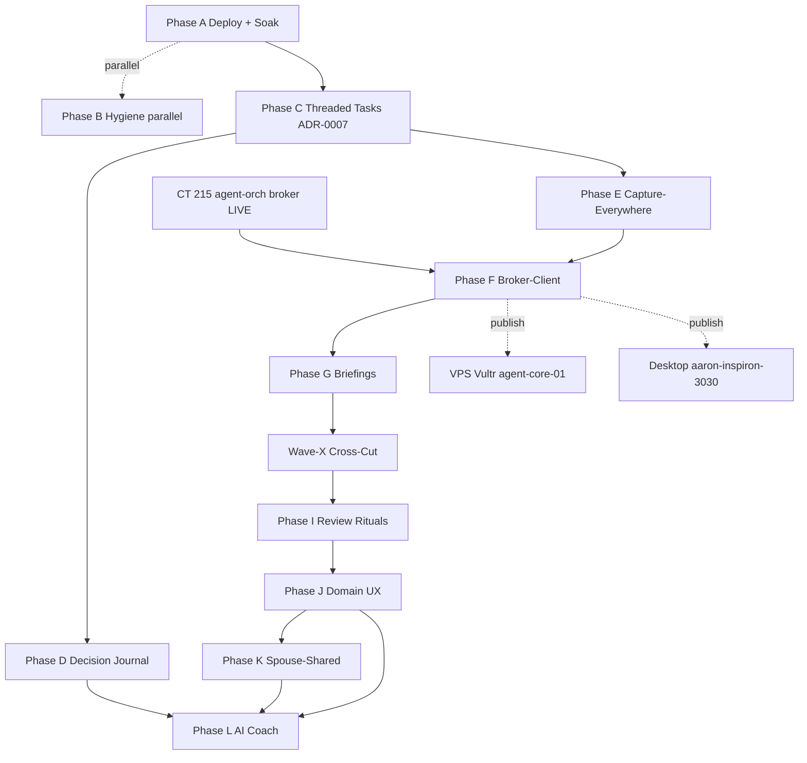

# Life OS v1.0 — Master Plan v2 (Pivot Revision)

> **Supersedes:** `2026-05-12-LIFE-OS-V1-MASTER-ROADMAP.md` (still valid as the deep-dive index; this doc is the corrected execution path).

**Date:** 2026-05-13 · **Branch:** `polish/prod-ready`

---

## TL;DR — The Pivot

Yesterday's roadmap assumed the LXC↔Desktop↔VPS communication layer was greenfield. **Wrong.** The `GRsoldier7/agent-orch-lxc` repo on **Proxmox CT 215** has already shipped Phase 1+2 of a FastAPI + Redis broker spine:

- `POST /tasks` · `/tasks/lease` · `/tasks/{id}/complete` · `/workers/heartbeat` · `/events` (SSE)
- Per-worker bearer tokens (server enforces `worker_id` matches token owner)
- Redis-backed durable queue under `agent:orch:*` ACL prefix on CT 205
- Lease state machine (ACTIVE→EXPIRED→RELEASED) with reaper-crash recovery
- W3C `traceparent` propagation across audit + log
- Hypothesis property tests over both
- VPS = Vultr `agent-core-01` @ `100.75.73.27` (OpenRouter free, `read_only`)
- Desktop = `aaron-inspiron-3030` @ `100.112.192.78` (64 GB + GPU, Ollama, `full_workspace`)

**OHO's job is to be a well-behaved client of that broker, not to build a parallel one.** This collapses 3-5 days of greenfield engineering into ~2 days of client integration + ACL/token plumbing. We also have to honor the existing patterns (W3C tracing, lease lifecycle, SSE), not invent new ones.

**One urgent side-effect:** the Telegram bot token leaked in `.planning/ROADMAP.md` (agent-orch-lxc) is the **same token** still live in OHO's `telegram-capture` workflow. Rotation at @BotFather unblocks BOTH repos and is now the single most urgent operator action.

---

## Drift corrections (apply to CLAUDE.md after this plan is approved)

| Claim in CLAUDE.md | Reality |
|---|---|
| "46 commits ahead of master, never PR'd" | now 63 commits ahead; PR #2 open + MERGEABLE since 2026-05-11 (see [docs/CURRENT-STATE.md](../CURRENT-STATE.md) for live count) |
| Roadmap = 7 phases | Now 9 phases + 1 cross-cut wave (per v1 master roadmap) |
| ADR-0006 fully shipped | Phase 4 (HTTP wire-in to live-dashboard-updater) **deferred** until P0.5 deploy |
| Implicit assumption: MinIO versioning ON | Now explicit P0.5 preflight gate (codified in `deploy_oho_runner.py`) |
| Implicit assumption: SSH direct to CT-202 | `pct exec` now first-class via `LXC_PCT_CTID` (commit `ea17af2`) |
| No mention of agent-orch-lxc broker | **Major external dependency** — CT 215 broker is a peer system OHO must integrate with |
| Tests: 311 pass + 1 skip | As of 2026-05-16 EOD: **492 pass + 1 skip** (full); 450 pass in `make verify` scope. See [docs/CURRENT-STATE.md](../CURRENT-STATE.md) for live count. |

---

## Definition of Amazing (unchanged from v1)

1. Daily Command Center is the only file Aaron opens to start his day.
2. Capture-to-action p95 < 24h.
3. Every AI output eval-gated.
4. Sensitive data never reaches a free-tier model — classifier-enforced.
5. System survives any single-component failure 7 days no operator intervention.
6. Decision Journal has ≥10 reviewed decisions with 90-day outcomes.
7. ≥2 life domains have a feature no off-the-shelf tool offers.

Adds for v2:
8. **OHO and the CT 215 broker share one canonical trace_id** end-to-end for every cross-host operation.
9. **No sensitive payload class ever crosses the OHO→broker edge** without explicit allow-list — classifier-enforced, not hope-enforced.

---

## Revised phase map

```
✅ P0      Stop-the-bleed                                  [shipped 2b518b1]
✅ P1      State machine + receipts                        [code 947e507; ⏳ deploy]
✅ P1.5    HTTP-runner sidecar                             [code a1bd438; ⏳ deploy]
✅ ADR-06  Daily Command Center                            [code 097892a; ⏳ deploy]
✅ DEPLOY-PATCHES   4 patches landed 2026-05-12            [a2213d1 → ea17af2]
✅ PLANNING  Master Roadmap v1 + 7 phase specs             [00cf972]
✅ COMMS-RECON   agent-orch-lxc reality check              [today]

⏳ P0.5    Deploy + soak (≥7 days clean)                   [BLOCKING GATE]
   │
   ├──→ HYG-A (Telegram rotation @BotFather) ← OPERATOR-ONLY; fixes both repos
   ├──→ HYG-B (OpenRouter rotation, GCAL OAuth, NotebookLM cleanup)  parallel
   │
🔒 P2      Threaded tasks (ADR-0007 first)                 [post-soak]
🔒 P2.5    Decision Journal (NEW)                          [rides P2 IDs]
🔒 P3      Capture-Everywhere — voice-first                [post-P2 IDs]
🔒 P3.5    OHO-as-broker-client (NEW)                      [comms client integration]
🔒 P4      Decision-Ready Briefings                        [eval-gated]
🔒 WAVE-X  Cross-cut: security + eval + observability + comms-dashboard
🔒 P5      Review Rituals (daily/weekly/monthly/quarterly/annual)
🔒 P6      Domain-Aware UX (8 domains + 4 named deliverables)
🔒 P6.5    Spouse-Shared Mode                              [Christy slice]
🔒 P7      AI Coach + Insight Loop                         [last; corrosive failure mode]
```

**Key change vs v1:** Inserted **P3.5 OHO-as-broker-client** between P3 and P4. Wave-X now has 4 named lanes (was lumped); "comms" lane is dashboard + audit, not broker construction.

---

## Phase-by-phase execution (the next 6 months)

Every phase below has: **Goal · Acceptance · Sub-lanes · Effort · Skills · Dependencies.**

Skills routing follows Foundation AddOn matrix: `polychronos-team` for spec-first phases, `n8n-workflow-architect` for workflow changes, `app-security-architect` for any new edge, `secure-by-design` for boundary validation, `mcp-server-builder` for new HTTP endpoints, `superpowers:test-driven-development` for every implementation lane, `superpowers:writing-plans` before each phase ships.

---

### ⏳ Phase A — Deploy + Soak Start (P0.5)

**Goal:** P1+P1.5+ADR-0006 live on CT 202; ≥7 days clean soak; unlock all downstream phases.

**Pre-flight (operator-only, ≤10 min):**
1. **Rotate Telegram token at @BotFather** (unblocks agent-orch-lxc Phase 4 + scrubs OHO `telegram-capture` workflow leak) ← **most urgent**.
2. Generate `OHO_RUNNER_TOKEN` (`openssl rand -hex 32`) → `.env`.
3. Set `LXC_PCT_CTID=202` + `LXC_SSH_HOST=root@<pve-host>` in `.env`.
4. Verify MinIO versioning ON: `mc version info <alias>/obsidian-vault`. Enable if needed.

**Execute:**
5. `make deploy-runner-dry` → review log.
6. `make deploy-runner` → applies.
7. `make build-home` → seeds Daily Command Center.
8. Confirm smoke pipeline + first brain-dump cron tick.

**Soak (7 days, no scope changes during):**
- Daily morning audit: `python3 scripts/audit_extraction_receipts.py`.
- Daily evening: tail `99_System/logs/`, command center fresh ≤36h, no error-handler emails.
- Tripwires from P0.5 spec abort to rollback procedure.

**Acceptance:** every soak-exit criterion from `phases/2026-05-12-P0-deploy-and-soak-start.md` §8 met.

**Effort:** S (1-2 days to ship), 7 days wall-clock for soak.

**Skills:** `superpowers:verification-before-completion`, `superpowers:systematic-debugging`, `careful` for any rollback.

---

### 🟢 Phase B — Hygiene Carry-Forwards (parallel with soak)

**Goal:** Knock down 6 orthogonal items that don't touch the soak gate.

**Lanes (fully parallel):**

| # | Item | Effort | Operator step? | Status |
|---|---|---|---|---|
| B1 | **Telegram bot token rotation** + scrub in BOTH repos (OHO `telegram-capture` workflow + agent-orch-lxc) | XS | Aaron at @BotFather | Most urgent |
| B2 | OpenRouter key rotation (cascade in `ai-brain` sub-workflow) | S | Aaron pastes new key | After B1 |
| B3 | GCAL OAuth → `GCAL_CRED_ID` → Weekend Planner redeploy | S | Aaron OAuth consent | Anytime |
| B4 | MTL `[completion::]` backfill from timestamps **(NO `[due::]` auto-tag — footgun)** | M | Review report triage | After P0.5 stable |
| B5 | NotebookLM stale-ID cleanup (canonical `d056e9d5-…`) | XS | None — script + commit | Anytime |
| B6 | `--no-reset` flag deprecation (after ≥7 clean soak days) | XS | None | Soak-gated |

**Skills:** `app-security-architect` for B1 (secret rotation playbook), `n8n-workflow-architect` for B3 redeploy.

**Acceptance:** every item closed with a commit; CLAUDE.md updated; rotation table populated in cross-cutting §1.A.

---

### 🔒 Phase C — Threaded Tasks (P2) — design-first ADR-0007

**Goal:** Stable task identity across edits, splits, merges, manual edits, re-extractions.

**Sub-lanes (parallel-safe within phase):**

| Lane | Deliverable | Effort | Skills |
|---|---|---|---|
| C1 | ADR-0007 promotion + `[id::]` generator + writer | M | `polychronos-team` (B.L.A.S.T.), `superpowers:writing-plans` |
| C2 | Backing-file shape (`30_Tasks/<area>/t-2026wNN-XXXX.md`) + YAML schema | M | `database-design` (for YAML/index shape) |
| C3 | MTL ↔ backing-file bidirectional sync + precedence rules | L | `superpowers:test-driven-development` heavy |
| C4 | Migration tool (3-phase: Plan→Apply→Verify) over existing MTL | M | `superpowers:systematic-debugging` |
| C5 | Audit script (`scripts/audit_threaded_tasks.py`) + 15-min cron during cutover week | S | — |
| C6 | Command Center renderer update (thread cards) | M | `frontend-design` (Dataview templates) |
| C7 | OHO runner endpoints: `POST /tasks/split` · `/tasks/merge` · `/tasks/archive` | M | `mcp-server-builder` pattern, `app-security-architect` |

**Acceptance:** every MTL line has a `[id::]`; backing files exist; round-trip edit on phone (Remotely-Save) survives a cron pass; audit clean for 7 days post-cut.

**Effort:** XL (~3-4 weeks).

**Dependencies:** P0.5 soak closed; MinIO versioning ON; runner sidecar live.

---

### 🔒 Phase D — Decision Journal (P2.5, NEW)

**Goal:** Every meaningful decision logged with options + chosen + why + 90-day review. The hip decision is the first worked example.

**Sub-lanes:**

| Lane | Deliverable | Effort |
|---|---|---|
| D1 | `40_Decisions/<area>/d-2026wNN-XXXX.md` shape + template | S |
| D2 | Decision capture CLI (`scripts/decision_new.py`) + Telegram `/decision` (after B1) | S |
| D3 | 90-day review cron + email surface | S |
| D4 | Render in Daily Command Center "decisions awaiting review" panel | S |
| D5 | Hip decision migration as first entry | XS |

**Acceptance:** ≥1 decision logged with 90-day review date; render in Command Center; review cron fires on day-90.

**Effort:** M (rides P2 IDs).

**Skills:** `life-os-designer`, `superpowers:brainstorming` (Aaron interactive for hip decision).

---

### 🔒 Phase E — Capture-Everywhere (P3) — voice-first

**Goal:** One canonical capture envelope, one endpoint (`POST /capture` on OHO runner), all surfaces normalize.

**Sub-lanes (sequenced, internal parallelism within each):**

| Lane | Deliverable | Effort |
|---|---|---|
| E1 | `/capture` endpoint + envelope v1 + idempotency store | M |
| E2 | Telegram v2: voice (Whisper local-default → API fallback) + photo OCR + commands | M |
| E3 | Email-forward capture (`capture@…` or 33mail) + DKIM/SPF + subject parsing | M |
| E4 | iOS/Android share-sheet client (small Shortcut/Tasker → HTTP POST) | S |
| E5 | Watch dictation surface | S |
| E6 | Wearable / biohacking-pipeline → health-domain captures | M |

**Acceptance:** every surface POSTs identical envelope; idempotency proven (same source_message_id never creates 2 tasks); audit logs every capture with provenance trail.

**Effort:** L (2-3 weeks).

**Skills:** `secure-by-design`, `n8n-workflow-architect`, `app-security-architect` (each new edge), `biohacking-data-pipeline` (for E6).

---

### 🆕 Phase F — OHO-as-Broker-Client (P3.5, NEW from comms pivot)

**Goal:** OHO becomes a well-behaved worker of the CT 215 agent-orch broker. NOT building broker — integrating.

**Sub-lanes:**

| Lane | Deliverable | Effort |
|---|---|---|
| F1 | `clients/agent_orch_client.py` — `POST /tasks`, `/tasks/lease`, `/tasks/{id}/complete`, `/workers/heartbeat` | S |
| F2 | SSE subscriber for `/events` — async, reconnect-on-drop, drop-oldest backpressure mirror | M |
| F3 | Worker registration: `oho-runner` worker_id + bearer token; ACL pair on tailnet; Bitwarden entry | S |
| F4 | W3C `traceparent` propagation — every OHO log/run-log gains `trace_id`; matches CT 215's existing trace columns | M |
| F5 | Privacy classifier (deny-list) — sensitive data classes (faith/family-named/kid-named/health biomarker) NEVER leave OHO→broker without allow-list; egress test in CI | M |
| F6 | OHO submits a real task type (eg., "summarize this brain dump on Desktop fleet because it's > 50KB") + result roundtrip via SSE | M |

**Acceptance:**
- OHO posts a task → Desktop or VPS worker picks it up → result lands back in OHO via SSE → audit shows single trace_id across all hops.
- Egress test: 100 sensitive-class payloads attempted, 0 reach the broker (rejected at OHO classifier).
- Token rotation drill: rotate the OHO worker_token, broker re-auths cleanly, zero message loss.

**Effort:** M (1-2 weeks).

**Skills:** `mcp-server-builder` (HTTP transport patterns), `app-security-architect` (bearer-edge hardening), `superpowers:test-driven-development`, `secure-by-design` (privacy classifier).

**Dependencies:** P3 envelope shape stable (intentional alignment); CT 215 broker running (it is).

---

### 🔒 Phase G — Decision-Ready Briefings (P4) — eval-gated

**Goal:** Morning briefing is a decision instrument, not a report. "Today's ONE thing · 3 unblock decisions · accountability lines · cross-domain conflicts · energy-window match · faith integration."

**Sub-lanes:**

| Lane | Deliverable | Effort |
|---|---|---|
| G1 | Briefing generator core (regex-first; AI cascade fallback) | M |
| G2 | Provenance trail — every claim links to source file:line | S |
| G3 | Email rendering (≤200 words HTML) + Command Center detail panel | S |
| G4 | Eval suite — factuality (binary), tone (1-5 Aaron-rated), length budget, non-prescription | M |
| G5 | Optional NotebookLM voice digest (OPT-IN; Aaron decision pending) | S |

**Acceptance:** 14 consecutive briefings shipped with ≥4.0 mean Aaron tone rating; eval suite passes; provenance trail 100% coverage; no claim cited without source.

**Effort:** M (1-2 weeks).

**Skills:** `polychronos-team` for cross-domain integration; `notebooklm` skill for G5; `superpowers:verification-before-completion`.

---

### 🌊 Phase H — Wave Cross-Cut (4 named lanes)

**Goal:** Before AI-heavy P5-P7, invest in infrastructure that prevents bad AI from corroding trust.

**Lanes (parallel, ~1 week total):**

| Lane | Deliverable | Effort |
|---|---|---|
| H1 — **Security** | `99_System/config/data-classes.yaml` (public/private/sensitive). Classifier intercepts AI prompts AND comms outbox. Bearer-token rotation table. | S |
| H2 — **Eval infra** | `evals/` directory, frozen test sets per AI workflow, weekly cron, `audit_eval_coverage.py` release gate | S |
| H3 — **Observability** | `99_System/health.md` Dataview-rendered. SLOs per workflow. Cost telemetry per token-spending workflow. Synthetic canary. | M |
| H4 — **Comms dashboard + audit** | `audit_comms_coverage.py` + Command Center "📡 Comms" panel + `comms-health-monitor` cron @ `:53` (slot free) | S |

**Acceptance:** AI prompts gated by data-class classifier in CI; weekly eval suite runs autonomously; Aaron answers "is system healthy?" in <30s from one view; comms panel surfaces last 24h cross-host messages + trace_ids.

**Effort:** M (1 week).

**Skills:** `app-security-architect`, `gsd-eval-planner` mindset, `secure-by-design`, `observability-baseline` (Aaron's existing skill).

---

### 🔒 Phase I — Review Rituals (P5)

(Spec unchanged from v1 — daily evening close, weekly review w/ auto-prep, monthly/quarterly/annual.)

**Effort:** M (~1 week). **Skills:** `personal-productivity-os`, `life-os-designer`, `notebooklm`.

---

### 🔒 Phase J — Domain-Aware UX (P6) + 4 Named Deliverables

(Spec unchanged. 8 domain dashboards + sermon-prep, CRM-lite, health-anomaly, family-timeline.)

**Effort:** L (~2 weeks). **Skills:** `obsidian-vault-architect`, `bible-study-theologian`, `sunday-school-teacher`, `health-biohacking-protocol`, `consulting-operations`.

---

### 🔒 Phase K — Spouse-Shared Mode (P6.5)

Conditional on Christy wanting it. Design-only until Aaron confirms.

**Effort:** M. **Skills:** `family-life-integration` (TBD).

---

### 🔒 Phase L — AI Coach + Insight Loop (P7) — must ship last

(Spec unchanged. 9 insight loops, direct file inclusion + grep [no embeddings v0], eval-gated, 4-week human-in-loop soak.)

**Effort:** L+ (4-6 weeks including soak).

**Skills:** `polychronos-team`, `health-biohacking-protocol`, `faith-life-integration`, **all** cross-cutting infra from Wave-X must be live.

---

## Execution timeline (weeks from 2026-05-13)

```
W1   [A deploy ▓▓ S] [B1 Telegram ▓ XS] [B2 OpenRouter ▓ S]
W1   [B3 GCAL ▓ S]   [B5 NLM cleanup ▓ XS]
W2   [        SOAK ▓▓▓▓▓▓▓▓▓ 7d ▓▓▓▓▓▓▓▓▓                ]
W2   [B4 MTL backfill dry-run ▓ M           ]
W3   [SOAK final audit ▓▓] [B6 --no-reset flip ▓ XS]
W3   [C ADR-0007 promotion ▓▓ S]
W4-7 [   C Threaded Tasks ▓▓▓▓▓▓▓▓▓▓▓▓▓ XL    ]
W4-7 [   D Decision Journal ▓▓▓ M  in parallel             ]
W8-10[   E Capture-Everywhere ▓▓▓▓▓▓▓ L         ]
W10-11[  F Broker-client ▓▓▓ M                              ]
W12  [   G Briefings ▓▓▓ M    ]
W13  [   H Wave Cross-Cut ▓▓▓▓ M                             ]
W14-15 [ I Review Rituals ▓▓▓ M                                ]
W16-18 [ J Domain UX ▓▓▓▓▓ L                                     ]
W18  [   K Spouse-Shared ▓▓ M                                       ] (conditional)
W19-23 [ L AI Coach (4 wk human-in-loop soak) ▓▓▓▓▓ L+                ]
```

~23 weeks (5.5 months) to v1.0. Same total budget as v1 — the broker pivot saves Phase F effort, the Wave-X split eats it back.

---

## Skill orchestration per phase (Foundation AddOn routing)

| Phase | Lead skill | Supporting skills |
|---|---|---|
| A Deploy | `superpowers:verification-before-completion` | `careful`, `superpowers:systematic-debugging` |
| B Hygiene | `app-security-architect` | `n8n-workflow-architect` |
| C Threaded tasks | `polychronos-team` (B.L.A.S.T.) | `database-design`, `superpowers:test-driven-development`, `frontend-design` |
| D Decision Journal | `life-os-designer` | `superpowers:brainstorming`, `personal-productivity-os` |
| E Capture-Everywhere | `n8n-workflow-architect` | `secure-by-design`, `app-security-architect`, `biohacking-data-pipeline` |
| F Broker-client | `mcp-server-builder` | `app-security-architect`, `secure-by-design`, `superpowers:test-driven-development` |
| G Briefings | `ai-agentic-specialist` (Foundation strategy tier) | `notebooklm`, `superpowers:verification-before-completion` |
| H Wave-X | `app-security-architect`, `observability-baseline` | `gsd-eval-planner` mindset |
| I Rituals | `personal-productivity-os` | `obsidian-vault-architect`, `notebooklm` |
| J Domain UX | `obsidian-vault-architect` | `bible-study-theologian`, `sunday-school-teacher`, `health-biohacking-protocol`, `consulting-operations` |
| K Spouse-Shared | TBD | depends on Christy alignment |
| L AI Coach | `polychronos-team` | `health-biohacking-protocol`, `faith-life-integration`, eval infrastructure (H must be live) |

**Always-on meta-layer** for every phase: `anti-hallucination`, `context-guardian`, `cognitive-excellence`, `efficiency-engine`, `prompt-amplifier`, `secure-by-design`, `session-optimizer`, `solution-architect-engine`, `verification-before-completion`.

---

## Parallel-execution recipe (where to fan out)

| Stage | Parallel agents | Output |
|---|---|---|
| Pre-phase research | 1 cavecrew-investigator + 1 ce-best-practices-researcher | spec stub + reference table |
| Phase spec | 1 `polychronos-team` orchestration | full design spec |
| Phase plan | 1 `superpowers:writing-plans` | task-graph PLAN.md |
| Phase implementation | N general-purpose subagents (one per sub-lane) | independent atomic commits |
| Phase verification | 1 ce-correctness-reviewer + 1 ce-security-reviewer (when applicable) | review report |
| Phase soak | 1 cron-driven audit + Aaron daily check | green-or-rollback |

`/cavecrew` style for compressed investigation. `/gsd-*` skills for structured phase machinery. `superpowers:dispatching-parallel-agents` for the fan-out itself.

---

## Cross-system dependency graph



---

## Consolidated open decisions (delta from v1)

**New from comms pivot:**

D1. **Push pings: allow Desktop to receive proactive nudges from LXC?**  Recommended: yes, full peer with local inbox daemon — enables P7 coach push.

D2. **VPS scope:** confirmed agent host (Vultr `agent-core-01`, OpenRouter free-only, read_only). No expansion needed for v1.0.

D3. **Sensitive-class allow-list when broker is involved:** default DENY-ALL. Faith, family-named, kid-named, health biomarker, prayer-journal → never leave OHO→broker. Confirmed.

D4. **CT 215 broker ACL pair on Tailscale:** OHO needs a worker_id (`oho-runner`) + bearer token registered with the broker. Bitwarden entry needed.

D5. **Telegram token rotation — most urgent.** Same token in both repos. Operator-only via @BotFather.

(Tier-1 from v1 + the 4 above; full register in v1 doc remains valid.)

---

## Risk register delta (v2 additions)

| # | Risk | L | S | Mitigation |
|---|---|---|---|---|
| 11 | CT 215 broker degrades during P3.5 client work | L | M | OHO works fine without it; broker calls degrade gracefully — `n8n-only` fallback path |
| 12 | Trace-id drift between OHO and broker tools | M | L | F4 codifies W3C `traceparent`; integration test asserts trace continuity |
| 13 | Privacy classifier false-negative leaks sensitive class to broker | L | XH | F5 deny-list + CI egress test + Bitwarden rotation drill |
| 14 | Two parallel code trees in agent-orch-lxc (`agents/orchestrator/` canonical vs `orchestrator/`) confuse the OHO client | M | M | F1 client targets the canonical tree only; recon doc flags both paths |
| 15 | CT 215 has only 4 GB RAM; broker + dashboard + LiteLLM may need expansion | M | M | Out of OHO scope but flagged for Aaron; OHO client is read-mostly |

---

## What ships THIS week (concrete)

**Day 1 (today, 2026-05-13):**
1. Aaron rotates Telegram token @BotFather (≤5 min). Tell Claude when done.
2. Generate `OHO_RUNNER_TOKEN` (`openssl rand -hex 32`) → append to `.env`.
3. Set `LXC_PCT_CTID=202` + `LXC_SSH_HOST=root@<pve-host>` in `.env`.
4. Verify MinIO versioning ON.
5. CLAUDE.md drift commit (Claude does autonomously after Aaron OK).

**Day 2:**
6. `make deploy-runner-dry` — review.
7. `make deploy-runner` — apply.
8. `make build-home` — seed command center.
9. First brain-dump cron tick verified.
10. Hygiene B5 (NotebookLM cleanup) lands.

**Day 3-9 (soak window, parallel hygiene):**
11. Daily audit + observability check.
12. B2 OpenRouter rotation (Aaron + Claude).
13. B3 GCAL OAuth (Aaron + Claude).
14. B4 MTL backfill **dry-run only** during soak; review report.
15. Master Plan v2 ADR promotion (`docs/adr/0007-master-plan-v2.md`).

**Day 10-11:**
16. Soak audit pass + `--no-reset` deprecation (B6).
17. ADR-0007 (threaded tasks) promotion.
18. Phase C kickoff with `polychronos-team` skill.

---

## Pointer index (depth lives here)

| Document | Owner |
|---|---|
| `docs/superpowers/2026-05-12-LIFE-OS-V1-MASTER-ROADMAP.md` | v1 (still valid as deep-dive index) |
| `docs/superpowers/2026-05-13-MASTER-PLAN-V2.md` | **this doc** |
| `docs/superpowers/phases/2026-05-12-P0-deploy-and-soak-start.md` | Phase A |
| `docs/superpowers/phases/2026-05-12-hygiene-carry-forwards.md` | Phase B |
| `docs/superpowers/phases/2026-05-13-agent-orch-lxc-recon.md` | **comms pivot intel** |
| `docs/superpowers/specs/2026-05-12-P2-threaded-tasks-spec.md` | Phase C |
| `docs/superpowers/specs/2026-05-12-P3-P4-capture-and-briefings-spec.md` | Phases E + G |
| `docs/superpowers/specs/2026-05-12-P5-P6-rituals-and-domain-ux-spec.md` | Phases I + J |
| `docs/superpowers/specs/2026-05-12-P7-ai-coach-insight-loop-spec.md` | Phase L |
| `docs/superpowers/specs/2026-05-12-cross-cutting-and-ambition-spec.md` | Wave-X |
| `docs/superpowers/specs/2026-05-13-comms-layer-lxc-desktop-vps-spec.md` | **Phase F design** |

---

*Synthesis of 4 parallel investigation agents dispatched 2026-05-13. The pivot: agent-orch-lxc shipped 80% of the comms infrastructure already; OHO integrates rather than rebuilds. Saves ~3-5 days of greenfield engineering. Master plan v2 is the corrected execution path.*
